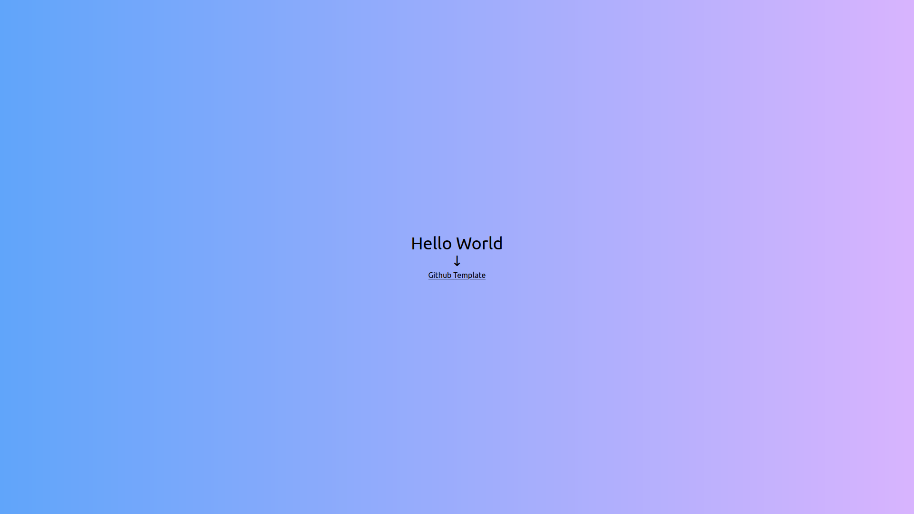
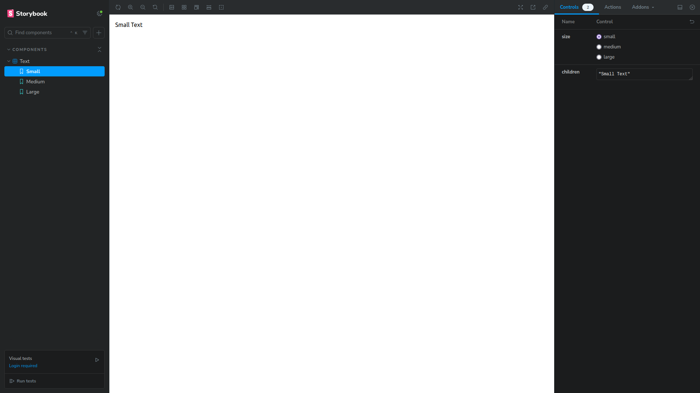

<h1 align="center">🚀 Next.js 15 Template 🚀</h1>

<p align="center">
  
  
  
  
  
  
  
  
</p>

<p align="center">
  <br>
  
  <br>
  <br>
</p>

## 📖 About The Project

This is a robust template for **Next.js 15** projects, pre-configured with a modern development stack to ensure productivity, code quality, and scalability. It includes tools for databases, testing, component documentation, and much more.

---

## ✨ Key Features

- **Framework:** [Next.js 15](https://nextjs.org/)
- **Language:** [TypeScript](https://www.typescriptlang.org/)
- **Styling:** [Tailwind CSS](https://tailwindcss.com/)
- **Database:** [PostgreSQL](https://www.postgresql.org/) with [Prisma ORM](https://www.prisma.io/)
- **Containerization:** [Docker](https://www.docker.com/)
- **Testing:** [Jest](https://jestjs.io/) & [Testing Library](https://testing-library.com/)
- **Component Documentation:** [Storybook](https://storybook.js.org/)
- **Code Quality:** [ESLint](https://eslint.org/) & [Prettier](https://prettier.io/)
- **Standardized Commits:** [Commitizen](https://commitizen-tools.github.io/commitizen/), [Commitlint](https://commitlint.js.org/) & [Husky](https://typicode.github.io/husky/)

---

## 🌿 Branches

This project has multiple branches to showcase different database configurations:

- **`master`**: The main branch, configured with **Prisma ORM**.
- **`Aleydon`**: A development branch, also configured with **Prisma ORM**.
- **`Drizzle`**: This branch is configured with **Drizzle ORM**.

---

## 🚀 Getting Started

### Prerequisites

- [Node.js](https://nodejs.org/en/) (version 18 or higher)
- [Docker](https://www.docker.com/get-started)

### Steps

1. **Clone the repository:**

   ```sh
   git clone https://github.com/Aleydon/Next15.git
   ```

2. **Navigate to the project directory:**

   ```sh
   cd Next15
   ```

3. **Install dependencies:**

   ```sh
   npm install
   ```

4. **Set up environment variables:**
   - Rename the `enviroment-example.env` file to `.env`.
   - Fill in the required environment variables in the `.env` file.

5. **Start the Docker environment:**
   - This command will build and start the PostgreSQL container.

   ```sh
   npm run docker:start
   ```

6. **Run the database migrations:**
   - This command will create the database tables based on your Prisma schema.

   ```sh
   npm run prisma:migrate
   ```

7. **Start the development server:**
   ```sh
   npm run dev
   ```

---

## 📜 Available Scripts

| Script            | Description                                                     |
| ----------------- | --------------------------------------------------------------- |
| `dev`             | Starts the Next.js development server.                          |
| `build`           | Builds the application for production.                          |
| `start`           | Starts a production server.                                     |
| `lint`            | Runs ESLint to analyze and fix the code.                        |
| `docker:start`    | Starts the services defined in `docker-compose.yml`.            |
| `prisma:migrate`  | Runs Prisma migrations to update the database.                  |
| `prisma:generate` | Generates the Prisma Client based on your schema.               |
| `prisma:studio`   | Opens Prisma Studio to view and edit your data.                 |
| `test`            | Runs the unit and integration tests.                            |
| `test:watch`      | Runs the tests in watch mode.                                   |
| `commit`          | Starts the Commitizen assistant to create standardized commits. |
| `storybook`       | Starts Storybook to view and develop components.                |
| `build-storybook` | Builds Storybook for production.                                |

---

## 🐳 Docker

The development environment uses Docker to manage the PostgreSQL database.

- **Start the container:**
  ```sh
  npm run docker:start
  ```
  This command will build and start the database container in the background.

---

## 💿 Prisma

Prisma is used as an ORM to interact with the database.

- **Apply migrations:**

  ```sh
  npm run prisma:migrate
  ```

  Creates and applies migrations to the database based on `schema.prisma`.

- **Generate Prisma Client:**

  ```sh
  npm run prisma:generate
  ```

  Generates or updates the Prisma Client whenever `schema.prisma` is modified.

- **Open Prisma Studio:**
  ```sh
  npm run prisma:studio
  ```
  Opens a visual interface in the browser to view and manage the database data.

---

## 🧪 Testing

This project uses **Jest** and **Testing Library** for testing.

- To run the tests, execute:
  ```sh
  npm run test
  ```
- To run the tests in watch mode:
  ```sh
  npm run test:watch
  ```

A test example can be found in `src/app/page.spec.tsx`.

---

## 🎨 Storybook

Visualize and develop your components in isolation with **Storybook**.

- To start Storybook:
  ```sh
  npm run storybook
  ```

A story example can be found in `src/app/components/Text/text.stories.tsx`.

<p align="center">
  <br>
  
  <br>
  <br>
</p>
